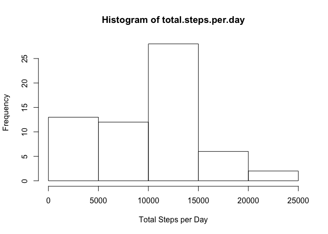
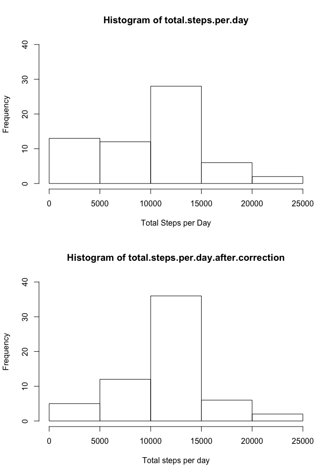
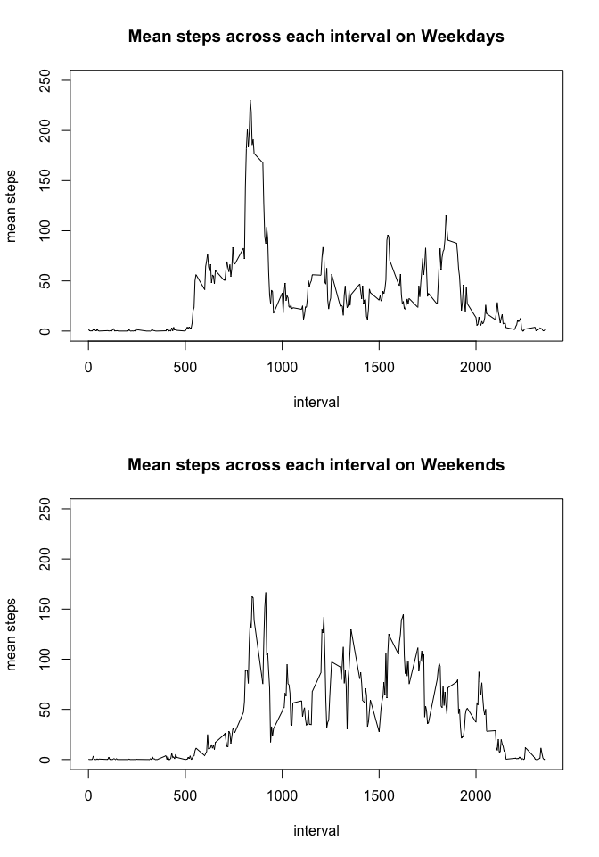

We are working with the data of the number of steps taken by an anonymous individual over a period of two months, collected with the help of a personl activity monitoring device. The device collects data at 5 minute intervals throughout the day.

## Loading and preprocessing the data
The data is given to us in the form of a zip file. We import this data by first unzipping this file to obtain a .csv file named *activity.csv* which is then read in using the `read.csv()` command in R.

```r
unzip('activity.zip')
data<-read.csv('activity.csv')
file.remove('activity.csv')
```

```
## [1] TRUE
```
Here we can see that once the data is read in, the `file.remove()` function is used to remove the unzipped file to preserve the original state of the repository.  

```r
str(data)
```

```
## 'data.frame':	17568 obs. of  3 variables:
##  $ steps   : int  NA NA NA NA NA NA NA NA NA NA ...
##  $ date    : Factor w/ 61 levels "2012-10-01","2012-10-02",..: 1 1 1 1 1 1 1 1 1 1 ...
##  $ interval: int  0 5 10 15 20 25 30 35 40 45 ...
```

```r
head(data)
```

```
##   steps       date interval
## 1    NA 2012-10-01        0
## 2    NA 2012-10-01        5
## 3    NA 2012-10-01       10
## 4    NA 2012-10-01       15
## 5    NA 2012-10-01       20
## 6    NA 2012-10-01       25
```
The data has been read in as a data frame with **17568 rows** and **3 columns**. As this is a widely used format in R, we will proceed to answer the remaining questions without making any further changes to this data.


## What is mean total number of steps taken per day?
To gain some insight to the data, let us first plot a **histogram** of the number of steps taken each day.

```r
par(mfrow = c(1,1))
sdata<-tapply(data$steps,data$date,sum,na.rm=TRUE)
total.steps.per.day<-sdata
hist(total.steps.per.day, xlab = "Total Steps per Day")
```

<!-- -->


When reading using the `read.csv()` function, all strings are automatically read in as factors, thus we can directly use the `tapply()` function to find the sum of the number of steps taken in each interval for each day. Here we also make use of the `na.rm = TRUE` option to avoid any errors due to missing data.  
Let us calculate the mean and the median of the *Total number of steps taken per day* across the 2 month period.

```r
mean_data<-mean(sdata)
print(paste('Mean:',as.character(mean_data)))
```

```
## [1] "Mean: 9354.22950819672"
```

```r
median_data<-median(sdata)
print(paste('Median:',as.character(median_data)))
```

```
## [1] "Median: 10395"
```

## What is the average daily activity pattern?
Each day is divided into 288 intervals of 5 mins each, ranging from 0 to 2355. Let us visualise the average number of steps taken in each interval across the period of 2 months.

```r
mean_across_interval<-tapply(data$steps,data$interval,mean,na.rm=TRUE)
x_val<-as.numeric(names(mean_across_interval))
plot(x_val,mean_across_interval,type="l", xlab = "Interval",ylab = "Steps")
```

<!-- -->


From this plot it is easy to see that the maximum of this value occours between the intervals 500 and 1000. Let us verify this...

```r
max_value<-which.max(mean_across_interval)
mean_across_interval[max_value]
```

```
##      835 
## 206.1698
```
Thus, we see that the maximum number of steps if usually taken in the interval **835-840** with a mean value of 206.


## Imputing missing values
It is common to find that the data provided for analysis has many missing values. Here too, this is the case. 

```r
unzip('activity.zip')
data<-read.csv('activity.csv')
file.remove('activity.csv')
```

```
## [1] TRUE
```

```r
sum(!complete.cases(data))
```

```
## [1] 2304
```
Here we see that there are 2304 rows which have missing entries and this may have an impact on our analysis. To fill up this missing data, we will use a simple scheme where we input the mean steps taken in that interval in all intervals where there is no data provided.

```r
data1<-data

for(i in 1:17568)
{
  if(is.na(data1$steps[i]))
  {
    data1$steps[i]<-mean_across_interval[as.character(data1$interval[i])]
  }
}
```
Here, we have created a new dataset `data1` which has all the missing values filled in.
Let us now compare the results of the analysis between the two datasets.

```r
sdata1<-tapply(data1$steps,data1$date,sum)
total.steps.per.day.after.correction<-sdata1

par(mfrow = c(2,1))
hist(total.steps.per.day, xlab = "Total Steps per Day", ylim = c(0,40))
hist(total.steps.per.day.after.correction, xlab = "Total steps per day", ylim = c(0,40))
```

<!-- -->

```r
mean_data1<-mean(sdata1)
print(paste('Old Mean:',as.character(mean_data)))
```

```
## [1] "Old Mean: 9354.22950819672"
```

```r
print(paste('New Mean:',as.character(mean_data1)))
```

```
## [1] "New Mean: 10766.1886792453"
```

```r
median_data1<-median(sdata1)
print(paste('Old Median:',as.character(median_data)))
```

```
## [1] "Old Median: 10395"
```

```r
print(paste('New Median:',as.character(median_data1)))
```

```
## [1] "New Median: 10766.1886792453"
```
Thus we can clearly see in both the histogram as well as the mean and median that the new data now has many observations where the total steps taken in a day moved from 0 to the daily mean, which is 10766.

## Are there differences in activity patterns between weekdays and weekends?
To compare the walking trends between weekdays and weekends, we make use of the new dataset that we have created.

```r
data1$day_of_week<-weekdays(as.Date(data1$date))
data1$weekend<- data1$day_of_week=="Saturday" | data1$day_of_week =="Sunday"
tempList<-split(data1,factor(data1$weekend))
df1<-tempList$'FALSE'
df2<-tempList$'TRUE'

head(data1)
```

```
##       steps       date interval day_of_week weekend
## 1 1.7169811 2012-10-01        0      Monday   FALSE
## 2 0.3396226 2012-10-01        5      Monday   FALSE
## 3 0.1320755 2012-10-01       10      Monday   FALSE
## 4 0.1509434 2012-10-01       15      Monday   FALSE
## 5 0.0754717 2012-10-01       20      Monday   FALSE
## 6 2.0943396 2012-10-01       25      Monday   FALSE
```

```r
par(mfrow = c(2,1))

mean_across_interval_df1<-tapply(df1$steps,df1$interval,mean,na.rm=TRUE)
x_val_df1<-as.numeric(names(mean_across_interval_df1))
plot(x_val_df1,mean_across_interval_df1,type="l", xlab = "interval", ylab = "mean steps", ylim = c(0,250))
title(main = "Mean steps across each interval on Weekdays")

mean_across_interval_df2<-tapply(df2$steps,df2$interval,mean,na.rm=TRUE)
x_val_df2<-as.numeric(names(mean_across_interval_df2))
plot(x_val_df2,mean_across_interval_df2,type="l", xlab = "interval", ylab = "mean steps", ylim = c(0,250))
title(main = "Mean steps across each interval on Weekends")
```

<!-- -->


Here we add 2 new columns to the dataset, which signify the day of the week and also signify if the day is a weekend or not. We plot a time series graph to understand the difference between the trends.
